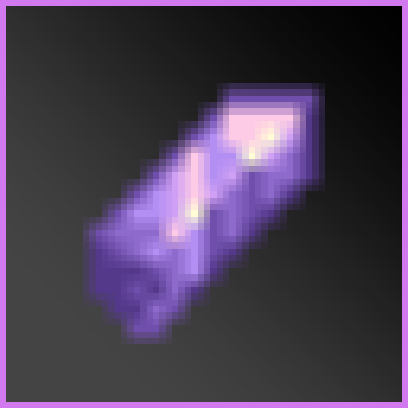

# MCDE Degilding



MCDE Degilding is a Fabric add-on for [MC Dungeons: Enchanting (MCDE)](https://github.com/BackupCup/MCDE). It adds a dedicated Degilding Table that removes one selected MCDE gilded enchantment from equipment.

MCDE 褪金台是 [MC Dungeons: Enchanting（MCDE）](https://github.com/BackupCup/MCDE) 的 Fabric 附属模组，新增用于移除装备中指定 MCDE 镀金词条的褪金台。

Insert equipment with MCDE gilding, select the gilding to remove, then click the same entry a second time within 5 seconds. Any other operation resets the confirmation progress.

将带有 MCDE 镀金词条的装备放入褪金台，选择要移除的词条，并在 5 秒内再次点击同一项目确认。任何其他操作都会重置双击确认进度。

## Features / 功能

- Adds a dedicated Degilding Table with Dungeon-style enchantment icons.<br>
  新增带有地下城风格附魔图标的褪金台。
- Removes one selected MCDE gilded enchantment while preserving other enchantments and runic slots.<br>
  移除一个指定的 MCDE 镀金词条，保留其他附魔与符文槽。
- Costs 16 iron ingots per removal in Survival mode.<br>
  生存模式每次褪金消耗 16 个铁锭。
- Greys out unavailable entries when there are not enough iron ingots, and shows `Requires 16 x Iron Ingot` on hover.<br>
  铁锭不足时，列表项目显示为灰色；悬停时显示“需要 16 x 铁锭”。
- Supports a scrollable gilding list for equipment with multiple gilded enchantments.<br>
  支持滚动查看多个镀金词条。
- Stores inserted equipment and iron ingots; breaking the table drops its contents.<br>
  保存放入的装备和铁锭；破坏方块时会掉落其中物品。
- Uses a 13/16-block-high collision and selection shape matching the model.<br>
  碰撞箱与选中框高度为 13/16 格，与模型高度一致。
- Does not block light and does not turn grass below it into dirt.<br>
  不阻挡光照，底部的草方块不会变为泥土。
- Uses stone placement and breaking sounds.<br>
  使用石头的放置与破坏音效。
- Includes English and Simplified Chinese translations.<br>
  提供英文与简体中文翻译。

## How To Use / 使用方式

1. Place the equipment to process in the item slot.<br>
   将需要处理的装备放入装备格。
2. Insert at least 16 iron ingots in the material slot.<br>
   在材料格放入至少 16 个铁锭。
3. Select a gilded enchantment from the list.<br>
   在列表中选择要褪去的镀金词条。
4. Click that same entry again within 5 seconds to remove it.<br>
   在 5 秒内再次点击同一项目，即可完成褪金。

Clicking another entry, moving an item, or performing any other operation cancels the pending second click.

点击其他词条、移动物品或进行任何其他操作都会取消本次双击确认。

## Crafting Recipe / 合成配方

Craft one Degilding Table with one amethyst shard centered above three deepslate blocks.

上方中间放置 1 个紫水晶碎片，底部一行放置 3 个深板岩，即可合成 1 个褪金台。

```text
              Amethyst Shard
              紫水晶碎片
Deepslate     Deepslate       Deepslate
深板岩        深板岩          深板岩
```

## Mining And Drops / 挖掘与掉落

The Degilding Table can be mined and dropped with an empty hand or any tool. Pickaxes mine it faster according to their tier.

褪金台可以用空手或任何工具挖掘并掉落。使用不同等级的镐会更快。

| Tool / 工具 | Approximate breaking time / 约需时间 |
| --- | --- |
| Empty hand or non-pickaxe tool<br>空手或非镐类工具 | 3 seconds<br>3 秒 |
| Wooden or golden pickaxe<br>木镐或金镐 | 2 seconds<br>2 秒 |
| Stone pickaxe<br>石镐 | 1.5 seconds<br>1.5 秒 |
| Iron pickaxe<br>铁镐 | 1 second<br>1 秒 |
| Diamond pickaxe<br>钻石镐 | 0.75 seconds<br>0.75 秒 |
| Netherite pickaxe<br>下界合金镐 | 0.5 seconds<br>0.5 秒 |

Breaking the table drops the block itself and all equipment or iron ingots stored inside it.

破坏褪金台会掉落方块本身，以及其中保存的装备与铁锭。

## Requirements / 前置与版本

| Minecraft | MCDE | Java |
| --- | --- | --- |
| 1.20.1 | 1.6.4-1.20 | 17 |
| 1.21.1 | 1.6.4-1.21 | 21 |

- Fabric Loader<br>
  Fabric 加载器
- Fabric API<br>
  Fabric API
- [MC Dungeons: Enchanting (MCDE)](https://github.com/BackupCup/MCDE)<br>
  [MC Dungeons: Enchanting（MCDE）](https://github.com/BackupCup/MCDE)

Source code and releases: [XTDPotato/MCDE-Degilding](https://github.com/XTDPotato/MCDE-Degilding)

源码与发布页：[XTDPotato/MCDE-Degilding](https://github.com/XTDPotato/MCDE-Degilding)

Built with Vibe Coding and GPT6 Astra.

使用 Vibe Coding 与 GPT6 Astra 协作完成。
